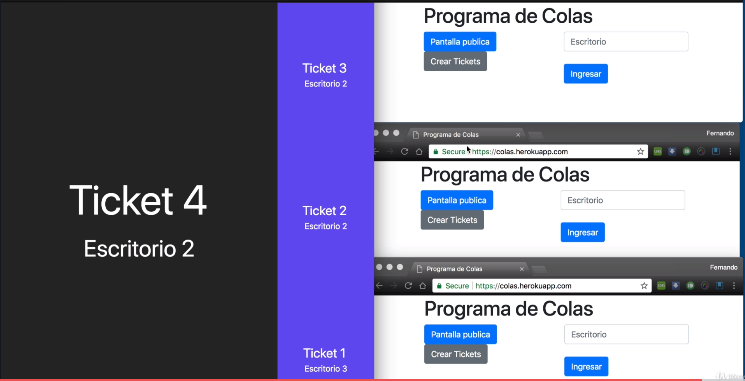

# Notas: 🗒

Este es un pequeño servidor de express listo para ejecutarse y servir la carpeta public en la web.

Recuerden que deben de reconstruir los módulos de node con el comando

```
npm install
```

- `npm start`


